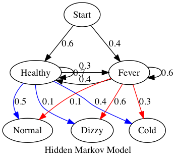
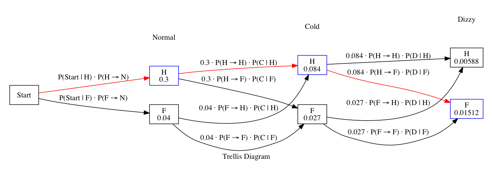

# Hidden Markov Model

One of the applications of HMM is to predict the sequence of state changes, based on the sequence of observations.

## Viterbi

The Viterbi Algorithm is a dynamic programming algorithm for finding the most likely sequence of hidden states - called the *Viterbi path* - that results in a sequence of observed events, especially in the context of Markov information sources and hidden Markov models.

## Trellis Diagram

